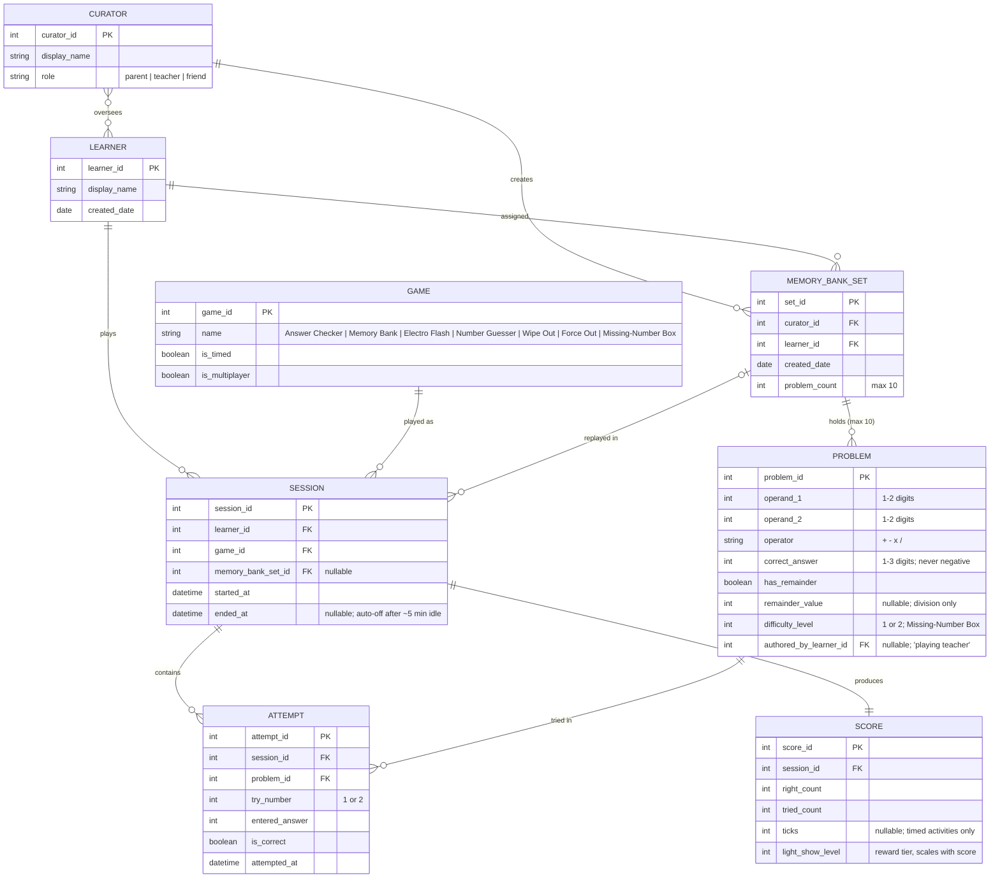
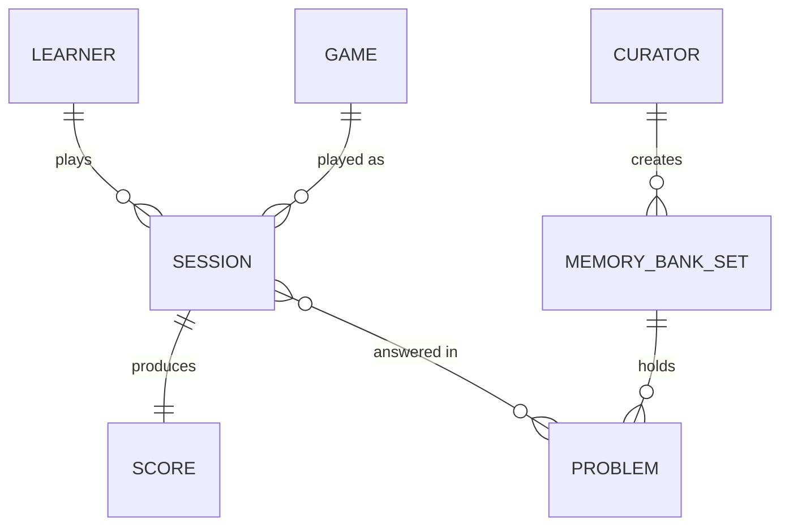
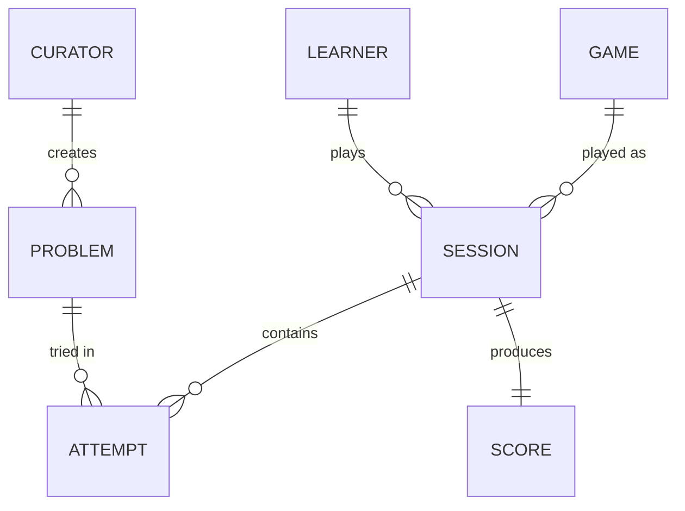

# Dataman Reference ERD (Known-Correct Data Model)

> **CLASS ARTIFACT — instructor grading key + student reference.** This is the *known-correct* data model for the Dataman modernization system, derived entirely from the transcribed 1977 manual (`reference/dataman/DATAMAN_MANUAL_TRANSCRIPT.md`) and reconcilable with the three stakeholder transcripts. It backs the Module 3 System Design Studio, the Sprint 1: System Design assessment, and autogradable knowledge-check items of the form *"which entity is missing from this ERD?"* Every entity below traces to at least one transcript (see the trace column). Do not hand students the "correct" model before they build their own — this is the answer key.

---

## 1. The correct model (Mermaid `erDiagram`)

---

## 2. Entity / attribute / relationship table

| Entity | What it represents | Key attributes | Traces to (transcript + manual) |
|---|---|---|---|
| **Learner** | The child who works problems. | display_name, created_date | Manual (the child/player, "young Earthlings"); Parent (Tomas); Teacher (24 students) |
| **Curator** | An adult or friend who loads problems and reviews progress. `role` ∈ {parent, teacher, friend}. | display_name, role | Manual p.6 ("You, one of your friends, or Mom or Dad can put up to ten problems"); Parent (loads facts); Teacher (per-kid sets) |
| **Game** | The activity/mode being played. Catalog of the seven modes. | name, is_timed, is_multiplayer | Manual pp.4–6, 22–25 (Answer Checker, Memory Bank, Electro Flash, Number Guesser, Wipe Out, Force Out, Missing-Number Box); Collector (all five games by name) |
| **Session** | One run of one Game by one Learner (e.g. a 10-problem Answer Checker run, or a Memory Bank replay). | started_at, ended_at, FKs to learner/game/(set) | Manual (a "round" of problems ends in a score + light show); auto-off after ~5 min (Manual p.5, p.21) — Parent ("when he wanders off it should stop") |
| **Attempt** | A single try at one Problem within a Session. At most **two** per problem. | try_number (1–2), entered_answer, is_correct | Manual pp.4–5, 20, 22 (two tries; EEE on wrong; correct answer shown after 2nd miss); Teacher ("first-try vs second-try tells me knows-it vs guessed-it") |
| **Score** | The recorded result of a Session: right / tried / (ticks) / reward tier. | right_count, tried_count, ticks, light_show_level | Manual pp.5, 20, 21, 23 (`9  10`, `6  7  .24`; light show scales with score); Parent ("8 out of 10"); Teacher ("summary for the kid") |
| **Problem** | A single math problem. | operands (1–2 digit), operator, correct_answer (1–3 digit, non-negative), has_remainder, remainder_value, difficulty_level, authored_by_learner_id | Manual pp.4–6, 20, 22, 25 (operand/answer digit limits; no negatives; division remainder "r"; box levels 1/2); Parent (specific facts); Teacher (kids author problems — "playing teacher") |
| **MemoryBankSet** | A curated collection of **up to 10** Problems, created by a Curator and assigned to a Learner. | created_date, problem_count (≤10), FKs to curator/learner | Manual p.6, p.21 ("put up to ten problems in my memory bank"); Parent ("punch in the five or six facts"); Teacher ("different sets for different kids") |

### Relationship notes

- **Curator }o--o{ Learner (oversees)** resolves to a join in implementation (a child has a parent *and* a teacher; a teacher has many children). Modeled here as many-to-many.
- **Session ||--|| Score** — every completed scored Session yields exactly one Score. (Open, un-scored practice in raw Answer Checker may end with no Score; model as a nullable/absent Score, an intentional design decision students may make either way.)
- **MemoryBankSet |o--o{ Session** — a Memory Bank Session draws its Problems from one assigned set; non-Memory-Bank Sessions reference no set (nullable FK).
- **Problem.authored_by_learner_id** captures the manual's "playing teacher" mechanic: some Problems are learner-authored, most are not (nullable).

---

## 3. Degraded variants (for "which entity/attribute is missing?" items)

Each variant below is **deliberately wrong**. Ship the diagram to students; keep the key.

### Variant A — the "Attempt" entity is missing

**Key — what is missing and what breaks:** There is **no `ATTEMPT` entity**. Correctness is collapsed onto the Session↔Problem link, so the model cannot represent:
- the **two-tries** rule (no `try_number`);
- **first-try vs. second-try** correctness — exactly the distinction Ms. Alvarez said tells "knows it" from "guessed it";
- the "**EEE then reveal the answer after the second miss**" behavior;
- *which* specific problems a learner missed and on which try (the parent's "the two he still missed").

The single correct answer to "which entity is missing?" is **Attempt** (with attributes `try_number`, `entered_answer`, `is_correct`).

### Variant B — the "MemoryBankSet" entity is missing

**Key — what is missing and what breaks:** There is **no `MEMORY_BANK_SET` entity**. Problems hang directly off a Curator with no grouping, so the model cannot represent:
- a **named, assignable set of up to 10** problems (the manual's hard limit and the core of both the parent's and teacher's #1 request);
- **assignment of a specific set to a specific learner** (Ms. Alvarez's "different sets for different kids");
- the **≤10 cardinality constraint** itself.
The correct answer is **MemoryBankSet** (aka the Memory Bank).

### Variant C — subtle attribute degradation (harder item)

Same shape as the correct model in §1, **but** `PROBLEM.has_remainder` / `remainder_value` are removed and `SCORE.ticks` is removed.

**Key — what is missing and what breaks:** Two attribute-level omissions:
- Without `has_remainder` / `remainder_value`, the model cannot represent **division-with-remainder** — the "r" behavior the collector and the manual both call out (whole-number answer + separate remainder).
- Without `SCORE.ticks`, the model cannot store **Atom-Clock timing**, so no timed game (Electro Flash, Wipe Out, Missing-Number Box) can record a result, and the collector's "ticks" and the teacher's timing concerns are both unrepresentable.

---

## 4. Boundaries / intentional non-entities

Students may reasonably *not* model these; do not mark them wrong for omitting them, and do not require them:

- **LightShow** as its own entity — the reward is fully captured by `SCORE.light_show_level`. Modeling it as an entity is acceptable but not required.
- **A separate "answer" entity** — an answer is `ATTEMPT.entered_answer`; it is not its own thing.
- **Battery / device-hardware state** (low-battery, service) — real device behavior, but a *hardware* concern outside the software data model. If a student models it, treat as out-of-scope color, not a core entity. (Traces to Manual p.24 Appendix; a legitimate source for **non-functional** stories, not data entities.)
- **Curator↔Learner permissions** — who may see whose data (raised by the teacher's "I see all my students'" and the parent's "his own") is a real requirement but is an access-control rule, not necessarily a distinct entity at this level.
